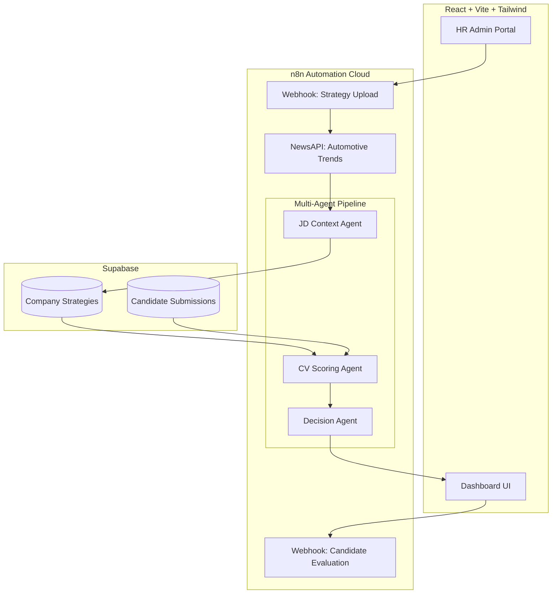

# BMW Leader Compass 🧭 🚗

**AI-Driven Decision Intelligence for Strategic Recruitment**

BMW Leader Compass is a cutting-edge, multi-agent AI recruitment pipeline designed for the **BMW Artificial Intelligence - Decision Systems** hackathon. It empowers HR leads to move beyond static resumes by fusing internal strategy documents with real-time market news to evaluate candidates against dynamic business scenarios.

---

## 🚀 Key Features

- **Strategic Context Injection**: Import PDF/CSV strategy plans and automatically fuse them with live **NewsAPI** data to create a "Living Job Description."
- **Multi-Agent AI Pipeline**:
  - **JD Context Agent**: Translates strategy and news into scenario-specific competency weights.
  - **CV Scoring Agent**: Ranks candidates (0-100%) across three critical business realities: *Automotive Continuity*, *Transformation*, and *Supply Chain Crisis*.
  - **Decision Intelligence Agent**: Provides a final, human-readable recommendation with risk mitigation strategies.
- **Dynamic Dashboard**: Real-time visualization of candidate fit, trait mapping, and decision rationale.
- **Vercel & n8n Integrated**: Production-ready deployment architecture.

---

## 🏗️ Technical Architecture



---

## 🛠️ Tech Stack

- **Frontend**: React 18, Vite, TypeScript, Tailwind CSS, Lucide Icons.
- **Orchestration**: n8n (Advanced AI Agentic Nodes).
- **Database**: Supabase (PostgreSQL).
- **AI Models**: OpenAI GPT-4o-mini (via n8n).
- **Market Intel**: NewsAPI.

---

## ⚙️ Setup & Installation

### 1. Local Development
```bash
# Clone the repository
git clone <repo-url>

# Install dependencies
npm install

# Run the dev server
npm run dev
```

### 2. Environment Variables
Create a `.env` if needed, but primary production links are configured in `src/lib/agentService.ts`:
- `VITE_WEBHOOK_URL`: Your n8n evaluation endpoint.
- `VITE_HR_WEBHOOK_URL`: Your n8n strategy upload endpoint.

### 3. n8n Configuration
Import the provided `BMW AI Final Decision System.json` into your n8n instance. 
> [!IMPORTANT]
> Ensure the **"Capture Binary Data"** toggle is ON in the HR Upload Webhook node to process PDF strategy documents.

---

## 🌐 Deployment

This project is optimized for deployment on **Vercel**:
1. Connect your GitHub repo to Vercel.
2. The project will automatically detect the Vite build settings.
3. Ensure your n8n instance is "Active" so the production webhooks are reachable.

---

## 🏁 Hackathon Credits
Developed for the **BMW hackathon — Artificial Intelligence Decision Systems**. 
*Focus: Enhancing the future of leadership selection through agentic AI.*

---
© 2026 BMW Leader Compass Team.
